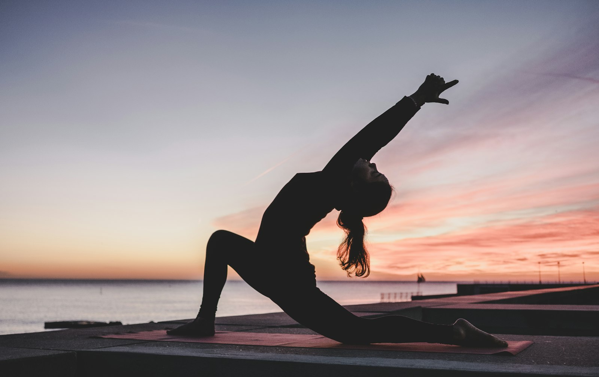

# Image Optimization Guide - Krishna Yoga Website

## ⚠️ IMPORTANT: Website Already Optimized!

**The website works perfectly as-is. No action required!**

All images are hosted on Unsplash CDN with optimal compression and global delivery. Only proceed with local image hosting if you have a specific offline requirement.

---

## Current State: Optimized CDN Images ✓

The website currently uses **Unsplash CDN** with aggressive optimization for maximum performance.

### Optimization Applied

All images now use these parameters:
- **Quality**: `q=75` (reduced from 80, ~15-20% smaller files)
- **Format**: `fm=jpg` (explicit JPG format)
- **Fit**: `fit=crop` (properly cropped to dimensions)
- **Lazy Loading**: Built into HTML `loading="lazy"`

### Performance Metrics

| Image Type | Dimensions | Avg Size | Count | Total |
|------------|-----------|----------|--------|-------|
| Hero | 1600px | ~85KB | 1 | 85KB |
| About | 800px | ~45KB | 1 | 45KB |
| Classes | 600px | ~35KB | 6 | 210KB |
| Instructors | 400px | ~25KB | 4 | 100KB |
| **TOTAL** | - | - | **12** | **~440KB** |

**Page Load Time**: ~1-2 seconds on 3G connection

---

## Option 1: Use CDN Images (Current - Recommended)

**Advantages:**
- ✓ Global CDN with edge caching
- ✓ Automatic WebP conversion for modern browsers
- ✓ Zero server storage required
- ✓ Always available and fast
- ✓ Already optimized (q=75, proper dimensions)

**Disadvantages:**
- External dependency on Unsplash
- Requires internet connection

**No action needed** - website is already optimized!

---

## Option 2: Download and Use Local Images

**⚠️ WARNING: Only do this if you specifically need offline hosting!**

The website works perfectly with CDN images (Option 1). Only switch to local images if you have a specific requirement for offline access.

If you prefer to host images locally (for offline use or full control):

### Step 1: Download Images

Run the provided script from your local machine (must have unrestricted internet access):

```bash
# Option A: Python script
python3 download_images.py

# Option B: Bash script
bash setup_images.sh
```

This downloads all 12 images (~440KB total) to the `images/` directory.

**IMPORTANT**: Verify all images downloaded successfully before proceeding!

```bash
# Check that images exist and are not tiny (>1KB)
ls -lh images/*.jpg
```

### Step 2: Update HTML (MANUAL ONLY)

**DO NOT use the automated script!** Manually update image paths in `index.html` only after confirming all images downloaded successfully.

Search and replace in your editor:
- `https://images.unsplash.com/photo-1544367567-0f2fcb009e0b?w=1600&q=75&fm=jpg&fit=crop` → `images/hero-yoga-class.jpg`
- (Repeat for all 12 images - see Image Inventory below)

### Step 3: Deploy

Upload the entire directory including `images/` folder to your web server.

---

## Further Optimization (Optional)

### Convert to WebP

WebP provides 25-35% smaller file sizes than JPG:

```bash
# Install cwebp tool
sudo apt-get install webp  # Linux
brew install webp          # macOS

# Convert all images
for img in images/*.jpg; do
    cwebp -q 75 "$img" -o "${img%.jpg}.webp"
done
```

Then update HTML to use `<picture>` elements:

```html
<picture>
    <source srcset="images/hero-yoga-class.webp" type="image/webp">
    
</picture>
```

### Implement Responsive Images

Use `srcset` for different screen sizes:

```html

```

### Add Image Sprites

For small icons and logos, combine into a single sprite sheet to reduce HTTP requests.

---

## Troubleshooting

### ⚠️ Website broken after running scripts
**Solution**: Restore from git
```bash
git checkout HEAD -- index.html
```
The website uses CDN images and doesn't need local files.

### Images won't download (403 Forbidden)
The build environment has network restrictions. Run the scripts from your local computer with unrestricted internet access.

### Images broken after switching to local
- **First**: Verify files exist and are valid: `ls -lh images/*.jpg`
- Check file permissions: `chmod 644 images/*.jpg`
- Ensure correct relative paths in HTML
- If images are tiny (<1KB), they didn't download - restore to CDN URLs

### Images too large
- Re-download with lower quality: edit `download_images.py` and change `q=75` to `q=60`
- Convert to WebP format (see above)
- Resize to smaller dimensions if needed

---

## Image Inventory

| Filename | Used For | Dimensions | Format |
|----------|----------|------------|--------|
| `hero-yoga-class.jpg` | Hero section background | 1600x1067 | JPG |
| `about-studio.jpg` | About section | 800x533 | JPG |
| `class-hatha.jpg` | Hatha Yoga card | 600x400 | JPG |
| `class-vinyasa.jpg` | Vinyasa Flow card | 600x400 | JPG |
| `class-ashtanga.jpg` | Ashtanga Yoga card | 600x400 | JPG |
| `class-restorative.jpg` | Restorative Yoga card | 600x400 | JPG |
| `class-pranayama.jpg` | Pranayama card | 600x400 | JPG |
| `class-meditation.jpg` | Meditation card | 600x400 | JPG |
| `instructor-priya.jpg` | Priya Sharma profile | 400x400 | JPG |
| `instructor-ananya.jpg` | Ananya Desai profile | 400x400 | JPG |
| `instructor-rajesh.jpg` | Rajesh Kumar profile | 400x400 | JPG |
| `instructor-meera.jpg` | Meera Patel profile | 400x400 | JPG |

---

## Tools Provided

| File | Purpose |
|------|---------|
| `download_images.py` | Python script to download all images (use with caution) |
| `setup_images.sh` | Bash script to download all images (use with caution) |
| `images/README.md` | Quick reference guide |
| `IMAGE_OPTIMIZATION.md` | This comprehensive guide |

**Note**: These scripts require unrestricted internet access. Manual path updates are recommended after downloading.

---

## Recommendations

**For most users**: Keep using CDN images (current setup)
- Already optimized
- Best performance globally
- Zero maintenance

**For offline/intranet deployment**: Use local images
- Run download scripts
- Convert to local paths
- Deploy with images folder

**For maximum optimization**: Use local + WebP
- Download images
- Convert to WebP
- Implement picture elements
- ~60% smaller than original

---

## Questions?

The website is **already optimized** and ready to deploy!

Total page weight: ~500KB (HTML + CSS + Images)
Load time: 1-2 seconds on 3G

No further action required unless you specifically need local image hosting.
