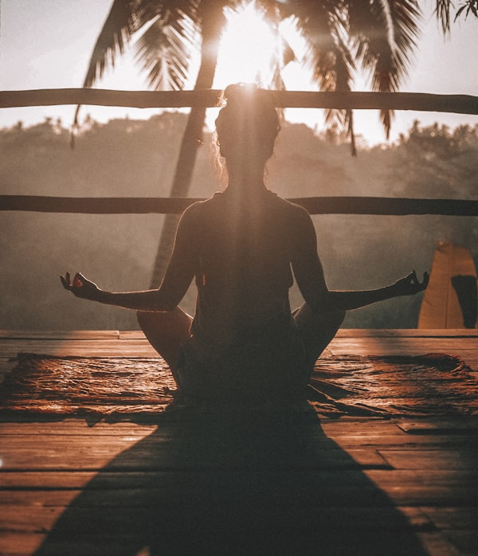

# Local Images Setup Guide

## Current Status

**Your website works perfectly with CDN images!** No action is needed unless you specifically want to host images locally.

## Why Use Local Images?

Only download images locally if you need:
- Offline website functionality
- Complete control over image files
- No external CDN dependencies
- Intranet deployment

**For 99% of users: Keep using CDN images (current setup)**

---

## How to Download Images Locally

### ⚠️ Important Notes

1. **This must be run from a computer with unrestricted internet access**
2. **Not from the build/deployment environment** (network restrictions will block downloads)
3. The script will automatically update HTML paths only if ALL images download successfully
4. A backup (`index.html.backup`) is created before any changes

### Step 1: Run the Setup Script

From your **local computer** (not the server):

```bash
cd /path/to/yoga
python3 setup_local_images.py
```

### Step 2: What the Script Does

The script will:
1. ✓ Create `images/` directory
2. ✓ Download all 12 images from Unsplash (~440KB total)
3. ✓ Verify each image downloaded successfully (>10KB)
4. ✓ Create backup of `index.html`
5. ✓ Update all image URLs to local paths
6. ✓ Verify the changes

### Step 3: Verify Locally

Open `index.html` in your browser and check:
- [ ] Hero section background appears
- [ ] All 6 class images load
- [ ] All 4 instructor images load
- [ ] About section image loads
- [ ] Visual calendar displays correctly
- [ ] Layout looks perfect

### Step 4: Deploy

If everything looks good:

```bash
# Delete the backup
rm index.html.backup

# Commit changes
git add images/ index.html
git commit -m "Switch to local image hosting"
git push origin your-branch-name
```

---

## What Gets Changed

### Before (CDN):
```html

```

### After (Local):
```html

```

### Images Downloaded:

| File | Size | Used For |
|------|------|----------|
| `hero-yoga-class.jpg` | ~85KB | Hero background |
| `about-studio.jpg` | ~45KB | About section |
| `class-hatha.jpg` | ~35KB | Hatha Yoga card |
| `class-vinyasa.jpg` | ~35KB | Vinyasa Flow card |
| `class-ashtanga.jpg` | ~35KB | Ashtanga Yoga card |
| `class-restorative.jpg` | ~35KB | Restorative Yoga card |
| `class-pranayama.jpg` | ~35KB | Pranayama card |
| `class-meditation.jpg` | ~35KB | Meditation card |
| `instructor-priya.jpg` | ~25KB | Priya Sharma |
| `instructor-ananya.jpg` | ~25KB | Ananya Desai |
| `instructor-rajesh.jpg` | ~25KB | Rajesh Kumar |
| `instructor-meera.jpg` | ~25KB | Meera Patel |

**Total:** ~440KB

---

## Troubleshooting

### "All downloads failed with HTTP 403"

**Cause:** Network restrictions blocking Unsplash downloads

**Solution:** Run the script from your local computer, not from:
- Build servers
- Deployment environments
- Restricted corporate networks
- Docker containers with proxy restrictions

### "Some images downloaded, some failed"

**What happens:** The script will NOT update HTML if any image fails

**Solution:**
1. Check your internet connection
2. Try again - temporary network issues may have occurred
3. If specific images keep failing, they may be unavailable

### "Website broken after running script"

**Solution:**
```bash
# Restore from automatic backup
mv index.html.backup index.html

# OR restore from git
git checkout HEAD -- index.html
```

### "Want to go back to CDN images"

**Solution:**
```bash
# Restore from git (before you made changes)
git checkout HEAD -- index.html

# Delete local images if desired
rm -rf images/
```

---

## Performance Comparison

### CDN Images (Current):
- ✓ Global edge caching
- ✓ Automatic WebP conversion
- ✓ No server storage needed
- ✓ Optimized delivery
- ✗ Requires internet connection

### Local Images:
- ✓ Offline functionality
- ✓ Complete control
- ✓ No external dependencies
- ✗ Uses server storage
- ✗ No edge caching
- ✗ You manage optimizations

---

## Advanced: Manual Download

If the script doesn't work, download manually:

```bash
# Create directory
mkdir -p images

# Download each image (repeat for all 12)
curl -L "https://images.unsplash.com/photo-1544367567-0f2fcb009e0b?w=1600&q=75&fm=jpg" \
  -o images/hero-yoga-class.jpg

# Then manually update index.html
# Replace each CDN URL with images/filename.jpg
```

See the script source code for all 12 URLs.

---

## Questions?

**Q: Should I use local images?**
A: Only if you need offline functionality or have specific requirements. CDN is recommended for most users.

**Q: Will this improve performance?**
A: Usually no - CDN is faster for most users due to global edge caching.

**Q: Can I use both CDN and local images?**
A: Not simultaneously - the website uses one or the other.

**Q: What if I want to update images later?**
A: With CDN, Unsplash may update images. With local, you control updates by replacing files.

---

## Summary

✅ **Website currently works perfectly with CDN images**
✅ **Script provided for local download if needed**
✅ **Automatic safety checks prevent broken website**
✅ **Backup created before any changes**

**Recommendation:** Keep using CDN unless you have a specific offline requirement!
